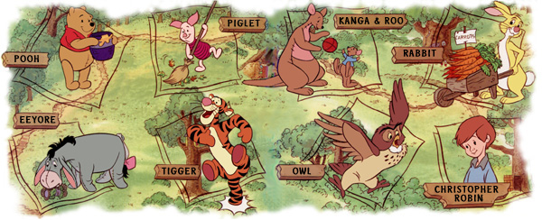

 

This is a course project for Practice for Compiler Design, School of EECS Peking University, 2018 autumn

Run following command,

```
$ make clean
$ make
```
and you will get three executable file in current path.

Usage:
 
```
$ ./eeyore srcfilename [destfilename]
$ ./tigger srcfilename [destfilename]
$ ./riscv64 srcfilename [destfilename]
```
The default destination is STDOUT.

Example:

```
$ ./eeyore hello.c hello.ee
$ ./tigger hello.ee hello.ti
$ ./riscv64 hello.ti hello.s
```
If you have installed riscv-qume you can run

```
spike pk hello.s
```
for a simulation run.